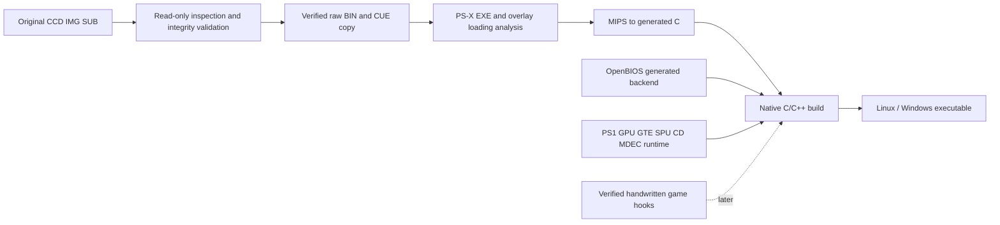

# Architecture and roadmap

## User decisions

- Native PC targets: Linux x64 and Windows x64.
- Approach: static recompilation with an existing PS1 hardware/runtime layer first.
- Foundation: extend the existing Time to Kill project, with pinned dependencies.
- Future direction: optional first-person play and related gameplay improvements.
- Documentation: substantial Markdown documentation in a separate workspace folder.

## Components

The PS1 CPU instruction stream is translated into native host code. Console-facing services still model the original hardware: guest addresses, interrupts, timing, DMA, geometry, rasterization, sound, and disc streaming. Native execution does not itself remove those dependencies.

The existing upstream project is mostly a bring-up scaffold. Its symbols file labels only the boot entry; its function seeds come from a direct-call scan. The local implementation therefore preserves the runtime baseline and adds independently reproducible disc evidence before modifying game behavior.

## Memory and code ownership

Generated C remains ignored and disposable. It is regenerated from the exact disc and emitter configuration. Do not hand-edit it as the source of a fix.

Use source configuration and verified symbols to describe boundaries and ownership. An address alone is insufficient for streamed code: a future hook must identify both the active image and the address, and validate original bytes. Shared overlay contents can be deduplicated, but different overlays at the same address must never be conflated.

Handwritten C/C++ should first provide diagnostics or narrow, verified behavior replacements. Do not reconstruct an entire renderer or asset pipeline merely to reach the first playable milestone.

## Milestones and exit criteria

### M0 — evidence and repeatable build scaffold

Exact source pins, original-image identity, full disc manifest, raw-sector validation, guarded import, native generator build, code generation, native runtime build attempt, documented result. These are the initial deliverables.

### M1 — original playable slice

Reach menus and gameplay. Demonstrate walking, turning, jumping, shooting, damage, death/restart, save/load, audio, and clean exit. Repeat on Windows and Linux with recorded settings and input steps. A running process is not enough.

### M2 — overlay and progression coverage

Establish loading destinations and transformations for all unique overlays. Exercise shared/base/bonus/movie code, level changes, return transitions, bosses, original multiplayer, and campaign completion. Audit fallback execution separately from native dispatch.

### M3 — stable PC experience

Reproducible builds, configurable input, reliable save paths, diagnostics appropriate for development, packaged clean-start checks, and platform-specific validation. Retain original timing until tested enhancements justify a change.

### M4 — optional first-person prototype

Verified camera/player/input hooks, coherent aiming, room visibility, body hiding, clipping, and scripted-state policy. See the dedicated first-person design.

## Defaults

Original 4:3 display, original simulation behavior, no new netplay, no forced overclock, no first-person feature enabled. Local development uses debug tooling and bypasses the setup launcher so failures are visible directly in logs. This is a developer build profile, not the intended final end-user interface.
